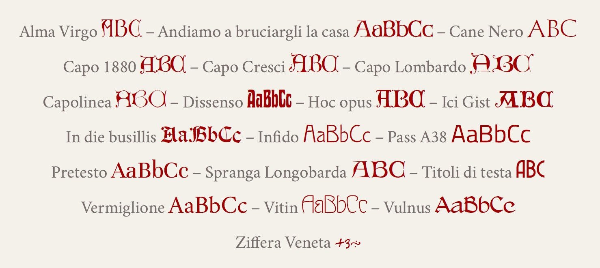

## Font

<a href="https://github.com/m-casanova/AlmaVirgo">Alma Virgo</a>
– <a href="https://github.com/m-casanova/AndiamoABruciargliLaCasa">Andiamo a bruciargli la casa</a>
– <a href="https://github.com/m-casanova/CaneNero">Cane Nero</a>
– <a href="https://github.com/m-casanova/Capo1880">Capo 1880</a>
– <a href="https://github.com/m-casanova/CapoCresci">Capo Cresci</a>
– <a href="https://github.com/m-casanova/CapoLombardo">Capo Lombardo</a>
– <a href="https://github.com/m-casanova/CapoVerso">Capo Verso</a>
– <a href="https://github.com/m-casanova/Capolinea">Capolinea</a>
– <a href="https://github.com/m-casanova/DisSenso">Dissenso</a>
– <a href="https://github.com/m-casanova/HocOpus">Hoc Opus</a>
– <a href="https://github.com/m-casanova/IciGist">Ici Gist</a>
– <a href="https://github.com/m-casanova/In-die-busillis">In die busillis</a>
– <a href="https://github.com/m-casanova/Infido">Infido</a>
– <a href="https://github.com/m-casanova/Pass-A38">Pass A38</a>
– <a href="https://github.com/m-casanova/PreTesto">PreTesto</a>
– <a href="https://github.com/m-casanova/SprangaLongobarda">Spranga Longobarda</a>
– <a href="https://github.com/m-casanova/titoliDiTesta">Titoli Di Testa</a>
– <a href="https://github.com/m-casanova/Vermiglione">Vermiglione</a>
– <a href="https://github.com/m-casanova/Vitin">Vitin</a>
– <a href="https://github.com/m-casanova/Vulnus">Vulnus</a>
– <a href="https://github.com/m-casanova/Ziffera-veneta">Ziffera veneta</a>
